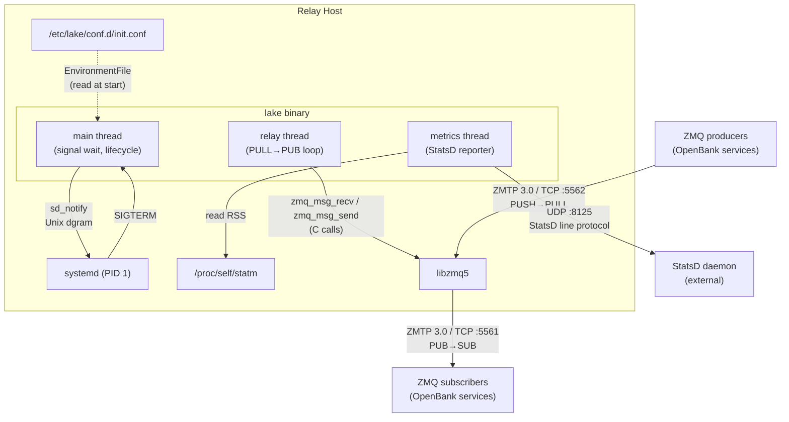

# Topology — Lake

## Deployment units

This system has one deployment unit. The relay is a single stateless binary running on a single host. There is no cluster, no multi-node coordination, no edge/central split. The question "what kinds of nodes exist?" has one answer: a relay host.

Justification for a single deployment unit: the component budget is 2 (binary + libzmq5), the operator profile is minimal, the hardware profile is a single commodity host, and there is no network partition to design around. Introducing a second deployment unit (e.g., a separate metrics aggregator, a config server, a sidecar) would violate constraint 9 (no additional runtime components) and exceed the component budget.

| Unit | Role | Trust level | Location | Connectivity | Offline capable |
|------|------|-------------|----------|--------------|-----------------|
| Relay host | Runs the lake binary — receives messages (ZMQ PULL), fans out (ZMQ PUB), reports metrics (StatsD UDP), integrates with systemd | Full — the binary runs as root-capable systemd service with `LimitNOFILE=1048576` | Single host (bare metal or VM or container) | Always-on LAN (TCP for ZMQ, UDP for StatsD, Unix datagram for sd_notify) | No — the relay is meaningless without network connectivity to message producers and consumers |

## Trust boundaries

The relay operates in a single trust domain. There is one trust boundary: the host's network perimeter.

```
┌─────────────────────────────────────────────────────────┐
│ Relay host (full trust)                                 │
│                                                         │
│  ┌──────────────┐  ┌───────────┐  ┌─────────────────┐  │
│  │ lake binary   │  │ libzmq5   │  │ systemd (PID 1) │  │
│  └──────────────┘  └───────────┘  └─────────────────┘  │
│                                                         │
└──────────┬──────────────┬──────────────┬────────────────┘
           │ TCP :5562    │ TCP :5561    │ UDP :8125
           │ (PULL)       │ (PUB)        │ (StatsD)
           ▼              ▼              ▼
    ZMQ producers   ZMQ subscribers   StatsD daemon
    (other OpenBank (other OpenBank   (pre-existing,
     services)       services)        external)
```

- **Inside the boundary**: The lake binary, libzmq5, systemd, the `/proc` filesystem, the configuration file, the Unix notification socket. All are implicitly trusted. The binary runs with elevated file descriptor limits and is restarted automatically on failure.
- **Outside the boundary**: ZMQ producers (PUSH clients connecting to the PULL port), ZMQ subscribers (SUB clients connecting to the PUB port), StatsD daemon (receives UDP metrics). All communicate over LAN TCP/UDP. No encryption (ZMQ NULL mechanism). No authentication. Any host that can reach the TCP/UDP ports can connect.
- **Secrets**: None. No TLS certificates, no API keys, no tokens. The only sensitive path is `$NOTIFY_SOCKET`, which is process-local and provided by systemd.

## Communication patterns

| From | To | Protocol | Payload | Offline behaviour | Direction |
|------|----|----------|---------|-------------------|-----------|
| ZMQ producers (external) | lake binary (PULL socket) | ZMTP 3.0 / TCP | Arbitrary binary messages | Producers queue locally (ZMQ built-in HWM); if lake is down, producers block or drop per their own HWM config | Inbound |
| lake binary (PUB socket) | ZMQ subscribers (external) | ZMTP 3.0 / TCP | Arbitrary binary messages (passthrough from PULL) | Subscribers miss messages sent while disconnected (PUB/SUB has no persistence); lake errors on send to slow subscriber (ZMQ_XPUB_NODROP=1) | Outbound |
| lake binary | StatsD daemon (external) | UDP | StatsD line protocol: counters and gauges with `openbank.lake` prefix | Fire-and-forget — UDP send silently fails if StatsD is unreachable. Relay continues operating. No retry, no queue. | Outbound |
| lake binary | systemd (PID 1) | Unix datagram | `READY=1`, `STOPPING=1` to `$NOTIFY_SOCKET` | Not applicable — systemd is always local. If the socket is missing, the notify call fails silently and systemd times out, killing the binary. | Outbound |
| lake binary (relay thread) | lake binary (PULL socket) | ZMTP 3.0 / TCP (loopback) | Empty message (shutdown unblock) | Not applicable — internal loopback | Internal |
| lake binary | `/proc/self/statm` | Filesystem read | RSS memory in pages | Not applicable — `/proc` is always available on Linux | Internal |
| systemd | lake binary | POSIX signal | SIGTERM | Not applicable — local process signal | Inbound |
| Operator / systemd | `/etc/lake/conf.d/init.conf` | Filesystem | Environment variable key=value pairs | Not applicable — local filesystem | Inbound |

## Topology diagram



## Component minimisation table

The following table challenges every capability row from the prima materia mapping. The topology has one deployment unit (the relay host) containing one binary and one C library. Every row is assessed: does it require a distinct runtime component, or is it an internal concern of the binary?

| Mapping row | Component | In topology? | If no: absorbed by | Rationale |
|-------------|-----------|-------------|---------------------|-----------|
| Language / runtime | Zig binary | Yes | — | The binary is the deployment unit |
| Build system | `build.zig` | No (build-time only) | Build infrastructure | Not a runtime component. Exists only at compile time. |
| ZMQ binding | `@cImport` of libzmq | Yes (part of binary + libzmq5) | — | The binding is compile-time; the runtime component is libzmq5 |
| ZMQ context/socket abstraction | Wrapper structs | No | Absorbed by relay code | Questionable in prima materia. In the topology, these are internal code patterns inside the binary — not components. Direct C calls with `defer` suffice. No separate abstraction layer needed. |
| ZMQ message abstraction | Wrapper struct | No | Absorbed by relay loop | Same reasoning — a local `var msg` + `defer` in the relay loop. Not a component. |
| ZMQ error handling | Error module | No | Absorbed by inline error handling | Zig calls `zmq_errno()` and `zmq_strerror()` at each call site. No separate module needed. |
| Relay loop | Relay thread | Yes (internal thread) | — | Core function of the binary |
| Metrics client | StatsD UDP sender | Yes (internal thread) | — | ~30 lines of UDP send code inside the metrics thread. Not a separate component — internal to the binary. |
| Memory monitoring | `/proc` reader | Yes (internal to metrics) | Absorbed by metrics thread | ~10 lines of file read. Internal to the metrics thread. |
| Logging implementation | Log writer | Yes (internal) | — | Internal to the binary. Writes to stdout. |
| Coloured terminal output | ANSI codes | No | Absorbed by logging | 4-byte escape sequences inline in the log writer. Not a component. Eliminated. |
| POSIX signal handling | Signal handler | Yes (internal to main thread) | — | Part of the main thread's lifecycle code |
| Cross-thread coordination | Atomic values | Yes (internal) | — | Stack-allocated atomics shared via pointer. Internal to the binary. |
| Thread management | OS threads | Yes (internal) | — | 2 threads spawned by the binary |
| systemd sd_notify | Unix datagram send | Yes (internal) | — | ~15 lines of socket send code. Internal to the binary. |
| Configuration loading | Env reader | Yes (internal) | — | ~20 lines of env parsing. Internal to the binary. |
| Debian packaging | `.deb` build scripts | No (build-time only) | Build infrastructure | Not a runtime component |
| Docker packaging | Dockerfiles | No (build-time only) | Build infrastructure | Not a runtime component |
| CI/CD pipeline | CI config files | No (build-time only) | Build infrastructure | Not a runtime component |
| Cross-compilation | Zig `-target` flag | No (build-time only) | Build infrastructure | Not a runtime component |
| Blackbox tests | Python test suite | No (test-time only) | Test infrastructure | Not a runtime component |
| Performance tests | Python perf suite | No (test-time only) | Test infrastructure | Not a runtime component |
| libzmq runtime dependency | `libzmq5.so` | Yes | — | The only runtime dependency beyond the binary itself |
| Rust formatter config | `.rustfmt.toml` | No | Eliminated | Artifact of source language. Remove. |
| Clippy lint config | Clippy attributes | No | Eliminated | Artifact of source language. Remove. |
| Dependabot cargo config | `.github/dependabot.yml` | No | Eliminated | Artifact of source language package ecosystem. Remove. |

### Elimination summary

The following components from the mapping are **eliminated** because they are either artifacts of the Rust source language, build-time-only concerns, or internal code patterns that do not constitute runtime components:

1. **ZMQ context/socket abstraction** — absorbed by direct C calls with `defer` cleanup in the relay code. No wrapper structs.
2. **ZMQ message abstraction** — absorbed by inline `var msg` + `defer zmq_msg_close` in the relay loop.
3. **ZMQ error handling module** — absorbed by inline `zmq_errno()` + `zmq_strerror()` at each error site.
4. **Coloured terminal output** — absorbed by inline ANSI escape sequences in the log writer.
5. **Rust formatter config** — artifact. Remove `.rustfmt.toml`.
6. **Clippy lint config** — artifact. No equivalent needed.
7. **Dependabot cargo config** — artifact. No Zig package registry dependencies to update.

### Runtime component count

| Component | Type | Managed by operator |
|-----------|------|-------------------|
| `/usr/bin/lake` | Binary (Zig-compiled, statically or dynamically linked) | Yes — installed via `.deb`, managed via systemd |
| `libzmq5.so` | Shared library (if dynamically linked) | Yes — installed via `.deb` dependency. Eliminated if static linking is chosen. |

**Total: 1 or 2 runtime components** (depending on the static/dynamic linking decision). Within the component budget of 2.

### ADR groupings derived from topology

The topology suggests the following ADR area groupings, derived from the deployment unit's internal structure and its external interfaces:

| Area | Concern | Mapping rows covered |
|------|---------|---------------------|
| 01-platform | Language, build system, compiler, cross-compilation, libzmq linking strategy | Language/runtime, Build system, ZMQ binding, libzmq dependency, Cross-compilation |
| 02-runtime | Relay loop, threading, atomics, signal handling, shutdown, sd_notify, configuration, logging | Relay loop, Thread management, Cross-thread coordination, POSIX signal handling, systemd sd_notify, Configuration loading, Logging, Metrics client, Memory monitoring |
| 03-packaging | Debian packaging, Docker images, CI/CD pipeline | Debian packaging, Docker packaging, CI/CD pipeline |
