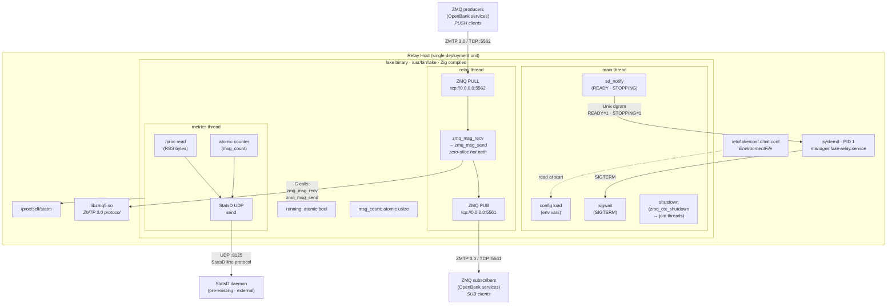

# High-level Architecture — Lake (on-prem / single-host)

## Diagram

## Relay subsystem

The relay subsystem is the core of the binary and the reason the system exists. It runs in a dedicated OS thread that blocks on `zmq_msg_recv` on the PULL socket, then immediately calls `zmq_msg_send` on the PUB socket — pure passthrough with zero per-message heap allocations ([ADR-02-01](../adr/02-runtime/adr-02-01-relay-loop.md)). The `zmq_msg_t` is stack-allocated and managed by libzmq's internal buffer system. All ZMQ functions are called directly via Zig's `@cImport("zmq.h")` with no wrapper structs or indirection layer ([ADR-01-03](../adr/01-platform/adr-01-03-zmq-binding.md)). Socket options (`ZMQ_CONFLATE=0`, `ZMQ_IMMEDIATE=1`, `ZMQ_LINGER=0`, `ZMQ_RCVHWM=0`, `ZMQ_SNDHWM=0`, `ZMQ_XPUB_NODROP=1`) are set identically to the Rust implementation to preserve wire behaviour. The only non-ZMQ operation in the loop is an atomic increment of the message counter for metrics. Throughput target is ≥750,000 messages/sec on commodity hardware (1 CPU, 2 GB RAM).

## Lifecycle and shutdown subsystem

The main thread owns the process lifecycle: it loads configuration from environment variables, initialises logging, sends `sd_notify READY=1`, creates the ZMQ context, spawns the relay and metrics threads, then blocks on `sigwait` for SIGTERM ([ADR-02-02](../adr/02-runtime/adr-02-02-lifecycle-shutdown.md)). On receiving SIGTERM, it sets the shared running flag to `false`, then calls `zmq_ctx_shutdown` — this interrupts the relay thread's blocking `zmq_msg_recv` by causing it to return `ETERM`, eliminating the fragile self-PUSH trick from the Rust implementation. After joining both threads, the main thread calls `zmq_ctx_term`, sends `sd_notify STOPPING=1`, and exits cleanly. The entire shutdown completes in ~1-2 seconds, well within the systemd `TimeoutStopSec=3` budget. This is a reliability improvement over the Rust version, which used `libc::raise(SIGTERM)` from worker threads and a loopback PUSH connection — both of which had failure paths that could deadlock.

## Observability subsystem

The metrics thread runs a 1-second loop: read the atomic message counter (swap to 0), read `/proc/self/statm` for RSS memory, format both into StatsD line protocol, and send a single UDP datagram to the configured StatsD endpoint ([ADR-02-04](../adr/02-runtime/adr-02-04-observability.md)). The StatsD client is hand-rolled (~30 lines) using `std.posix.socket` / `std.posix.sendto`. UDP sends are fire-and-forget — if the StatsD daemon is unreachable, the send fails silently and the relay continues operating unaffected. The `/proc` reader is ~10 lines of Zig standard library file I/O, replacing the Rust `procfs` crate and its transitive dependencies (chrono, flate2, hex). Logging uses a custom `std.log` function that writes ISO-8601 timestamped, ANSI-coloured output to stdout for capture by journald. Log level is runtime-configurable via `LAKE_LOG_LEVEL`. Zero third-party dependencies for the entire observability subsystem.

## Threading and coordination subsystem

The binary uses three OS threads: main, relay, and metrics ([ADR-02-03](../adr/02-runtime/adr-02-03-threading-coordination.md)). Shared state consists of two atomic values allocated on main's stack: a `std.atomic.Value(bool)` running flag and a `std.atomic.Value(usize)` message counter. Pointers to these atomics are passed to spawned threads via explicit context structs — no heap allocation, no reference counting, no `Arc`. This is safe because the program has a strict linear lifecycle: main creates shared state → spawns threads → blocks on `sigwait` → sets running to false → joins all threads → returns. The shared state always outlives all threads. This design eliminates the 2 heap allocations and 2 atomic reference counts from the Rust `Arc` implementation, placing the hot atomics on main's stack where they are likely to remain in L1 cache.

## Platform and build subsystem

The binary is compiled with the Zig build system via `build.zig` ([ADR-01-02](../adr/01-platform/adr-01-02-build-system.md)). Zig is pinned to a specific version (0.13.x) in `build.zig.zon` and CI configuration to mitigate pre-1.0 instability ([ADR-01-01](../adr/01-platform/adr-01-01-language-zig.md)). Cross-compilation for amd64 and arm64 is built-in (`-Dtarget=aarch64-linux`), eliminating the need for clang-13, LLD, and separate cross-toolchain installation. The binary links dynamically against system `libzmq5.so` ([ADR-01-04](../adr/01-platform/adr-01-04-libzmq-linking.md)), preserving the `.deb` dependency contract and enabling independent security patching of libzmq. Static linking is available as a build flag for future container-optimised deployments. Release builds use `ReleaseFast` optimization with stripping enabled.

## Packaging and deployment subsystem

The binary is distributed as a `.deb` package and Docker images, with the existing packaging structure preserved unchanged ([ADR-03-01](../adr/03-packaging/adr-03-01-debian-docker-packaging.md)). The package installs `/usr/bin/lake`, four systemd units (`lake.service`, `lake-relay.service`, `lake-watcher.path`, `lake-watcher.service`), and a default config file at `/etc/lake/conf.d/init.conf`. Docker images for amd64 and arm64 are based on Debian sid-slim and install the `.deb`. The CI pipeline (CircleCI, GitHub Actions, Jenkins) is adapted to use a Zig-based build image instead of the Rust image, with the pipeline structure — build → test → package → blackbox-test → publish → release — preserved ([ADR-03-02](../adr/03-packaging/adr-03-02-ci-cd-pipeline.md)). The `dev/lifecycle/` shell scripts retain their external interface (`--source`, `--output`, `--arch` flags) while replacing internal Cargo calls with Zig build commands. The operator's deployment workflow is unchanged: `apt install lake` or `docker run openbank/lake`.

## Security

The relay uses the ZMQ NULL security mechanism — no encryption and no authentication on the ZMTP 3.0 wire protocol. Any host on the LAN that can reach TCP ports 5562 (PULL) or 5561 (PUB) can connect. The StatsD UDP channel is also unauthenticated. The only protected communication path is the `sd_notify` Unix datagram socket, which is process-local and provided by systemd. There are no secrets, no TLS certificates, no API keys, and no tokens in the system. This matches the current Rust implementation and is consistent with the compliance constraint (none stated).

## Traffic and communication summary

| From | To | Protocol | Purpose | ADR |
|------|----|----------|---------|-----|
| ZMQ producers (external) | lake PULL socket | ZMTP 3.0 / TCP :5562 | Ingest messages from OpenBank services | [ADR-02-01](../adr/02-runtime/adr-02-01-relay-loop.md) |
| lake PUB socket | ZMQ subscribers (external) | ZMTP 3.0 / TCP :5561 | Fan out messages to OpenBank services | [ADR-02-01](../adr/02-runtime/adr-02-01-relay-loop.md) |
| lake metrics thread | StatsD daemon (external) | UDP :8125 | Report `openbank.lake.message.relayed` (count) and `openbank.lake.memory.bytes` (gauge) every 1 second | [ADR-02-04](../adr/02-runtime/adr-02-04-observability.md) |
| lake main thread | systemd (PID 1) | Unix datagram (`$NOTIFY_SOCKET`) | sd_notify: `READY=1` on startup, `STOPPING=1` on shutdown | [ADR-02-02](../adr/02-runtime/adr-02-02-lifecycle-shutdown.md) |
| systemd (PID 1) | lake main thread | POSIX signal (SIGTERM) | Initiate graceful shutdown | [ADR-02-02](../adr/02-runtime/adr-02-02-lifecycle-shutdown.md) |
| lake metrics thread | `/proc/self/statm` | Filesystem read | Read RSS memory in pages for memory gauge metric | [ADR-02-04](../adr/02-runtime/adr-02-04-observability.md) |
| lake main thread | `/etc/lake/conf.d/init.conf` | Filesystem read (via systemd EnvironmentFile) | Load runtime configuration (ports, log level, StatsD endpoint) | [ADR-02-02](../adr/02-runtime/adr-02-02-lifecycle-shutdown.md) |
| lake binary | stdout | Pipe (captured by journald) | Structured log output: `YYYY-MM-DDTHH:MM:SSZ LVL [target] message` | [ADR-02-04](../adr/02-runtime/adr-02-04-observability.md) |

## Encryption summary

| Layer | Mechanism | ADR |
|-------|-----------|-----|
| ZMQ PULL / PUB (TCP) | None — ZMTP 3.0 NULL mechanism. No encryption, no authentication. | [ADR-01-03](../adr/01-platform/adr-01-03-zmq-binding.md) |
| StatsD (UDP) | None — plaintext UDP. Fire-and-forget. | [ADR-02-04](../adr/02-runtime/adr-02-04-observability.md) |
| sd_notify (Unix datagram) | None — process-local Unix socket provided by systemd. Not network-accessible. | [ADR-02-02](../adr/02-runtime/adr-02-02-lifecycle-shutdown.md) |
| Logging (stdout) | None — plaintext to stdout pipe, captured by journald. | [ADR-02-04](../adr/02-runtime/adr-02-04-observability.md) |
| Data at rest | None — the relay is stateless; no data is persisted. | — |
