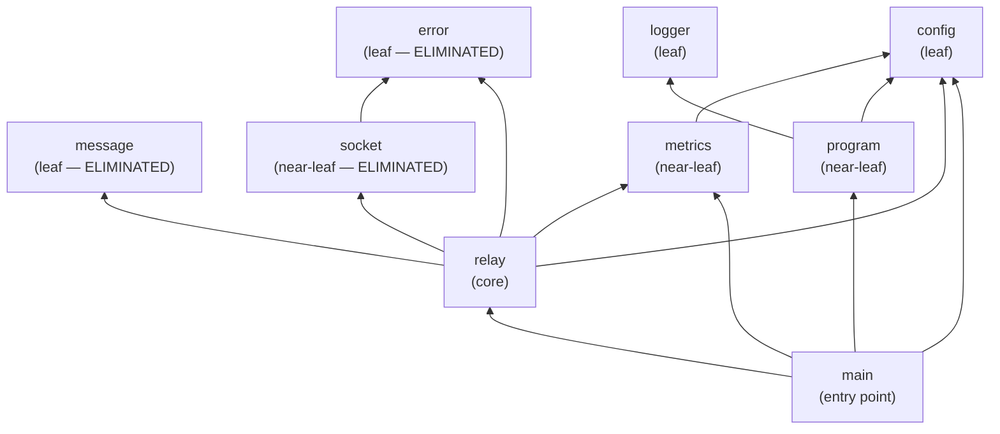
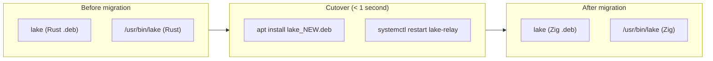

# Migration Plan — Lake (Rust → Zig)

## Nature of the migration

This is a **full language conversion** of a single binary crate (~400 lines, 9 Rust modules) from Rust to Zig. The binary is stateless, has no database, no persistent state, no API consumers beyond the ZMQ wire protocol. It is deployed as a single `.deb` package and Docker image.

Because the binary is small, stateless, and has no shared-library API (no callers link against it), the migration is an **atomic replacement**: the Rust binary is replaced entirely by the Zig binary in one release. There is no incremental, module-by-module coexistence period where Rust and Zig code run in the same process. The coexistence window is the deployment rollout — the old Rust `.deb` is installed, the new Zig `.deb` replaces it, and the service restarts.

This plan sequences the **development work** (which Zig code to write first, in what order, verified by which tests) even though the deployment is atomic. The sequencing follows the dependency graph: leaf modules first, core module last.

## Module dependency graph



Three modules (`error`, `message`, `socket`) are eliminated by the topology — their functionality is absorbed into the relay and main code as inline C calls. The remaining 6 modules are converted.

## Migration ordering

| Order | Module | Dependants | Dependencies | Conversion risk | Notes |
|-------|--------|-----------|-------------|----------------|-------|
| 1 | `config` | `main`, `metrics`, `program`, `relay` | None (internal) | Low | Leaf. Pure data: 4 env vars, fallback helpers. Trivial rewrite in Zig (~20 lines). Convert first because everything depends on it. Verify with a Zig unit test. |
| 2 | `logger` | `program` | None (internal); `log` + `colored` (external, eliminated) | Low | Leaf. Custom `std.log` function with ANSI codes and ISO-8601 timestamps. No external deps in Zig. Verify by inspecting stdout format. |
| 3 | `metrics` | `main`, `relay` | `config`; `statsd` + `procfs` (external, eliminated) | Medium | Near-leaf. Hand-rolled StatsD UDP client (~30 lines) + `/proc` reader (~10 lines). Replaces 2 Rust crates. Verify with StatsD mock from blackbox tests. Pattern map risks: comptime platform dispatch (pattern 13). |
| 4 | `program` (→ lifecycle) | `main` | `config`, `logger` | Medium | Near-leaf. sd_notify + signal handling + shutdown sequence. This is where the reliability improvement lives (zmq_ctx_shutdown replaces self-PUSH). Pattern map risks: signal handling (patterns 11, 12, 21), MaybeUninit (pattern 8). Verify with management.feature blackbox test. |
| 5 | `relay` + `error` + `message` + `socket` (combined) | `main` | `config`, `metrics`, `socket`, `message`, `error` | High | Core module. The topology eliminated `error`, `message`, and `socket` as separate modules — their code is absorbed inline into the relay. All ZMQ C calls, the blocking recv/send loop, socket setup, socket options. Pattern map risks: all FFI patterns (1, 2, 3, 10, 16, 22), Drop→defer (pattern 3), Arc→stack atomics (patterns 4, 5, 6, 7). Verify with relay.feature blackbox test + perf test. |
| 6 | `main` (entry point) | None | `config`, `metrics`, `program`, `relay` | Medium | Entry point. Wires everything together: config → logger → sd_notify → ZMQ context → spawn threads → sigwait → shutdown. Depends on all other modules being complete. Verify with full blackbox suite (all 6 features). |
| 7 | Build system + packaging | None | All source | Medium | `build.zig`, `build.zig.zon`, updated `dev/lifecycle/` scripts, CI config. Verify by producing `.deb` and Docker image, running install.feature + uninstall.feature. |

## Coexistence design

| Concern | Strategy | Duration |
|---------|----------|----------|
| Database sharing | Not applicable — the relay is stateless. No database, no persistent state. | — |
| Request routing | Not applicable — the old and new binaries are never running simultaneously. The systemd unit starts one binary. `apt upgrade` replaces the `.deb` and restarts the service. | — |
| Session / auth | Not applicable — no sessions, no authentication. ZMQ NULL mechanism. | — |
| Data consistency | Not applicable — no data to keep consistent. Messages are transient. | — |

**Coexistence is trivial because the relay is stateless.** There is no dual-run period. The migration is a package replacement: `apt install lake` installs the Zig binary over the Rust binary, `systemctl restart lake-relay` starts the new version. If the new version fails, the operator reinstalls the old `.deb`.



## Interop boundary design

There are no interop boundaries during migration. The Rust and Zig code never run in the same process and never communicate with each other. The migration is a full replacement, not a strangler fig.

The only "boundary" is the **external contract**: the Zig binary must be indistinguishable from the Rust binary to all external consumers (ZMQ clients, StatsD, systemd, the operator). This boundary is defined by the 13 external contracts in the pattern map and verified by the 6 blackbox tests.

| Step | Boundary type | Contract | Authoritative side |
|------|--------------|----------|-------------------|
| Cutover | Binary replacement via `.deb` | All 13 external contracts (wire protocol, metrics, sd_notify, env vars, packaging) | New (Zig) — the Zig binary must satisfy all contracts. If it does not, rollback to Rust binary. |

## Contract preservation plan

| # | Contract | Type | Verification method | When verified |
|---|----------|------|-------------------|---------------|
| 1 | ZMQ PULL ingest (ZMTP 3.0 / TCP :5562) | Wire protocol | `relay.feature` blackbox test: send message via PUSH, verify receipt | After step 5 (relay module) and step 6 (full integration) |
| 2 | ZMQ PUB fanout (ZMTP 3.0 / TCP :5561) | Wire protocol | `relay.feature` blackbox test: verify message arrives on SUB socket | After step 5 and step 6 |
| 3 | StatsD `openbank.lake.message.relayed` | UDP metric | `metrics.feature` blackbox test: verify StatsD mock receives count | After step 3 (metrics module) and step 6 |
| 4 | StatsD `openbank.lake.memory.bytes` | UDP metric | `metrics.feature` blackbox test: verify StatsD mock receives gauge | After step 3 and step 6 |
| 5 | systemd sd_notify (READY=1, STOPPING=1) | Unix datagram | `management.feature` blackbox test: start/stop/restart unit, verify running state | After step 4 (lifecycle module) and step 6 |
| 6 | Environment variables (LAKE_PORT_PULL, etc.) | Process env | `configuration.feature` blackbox test: configure log level, verify in journal | After step 1 (config module) and step 6 |
| 7 | Config file path | Filesystem | `install.feature`: verify `/etc/lake/conf.d/init.conf` exists after install | After step 7 (packaging) |
| 8 | Binary path `/usr/bin/lake` | Filesystem | `install.feature`: verify binary installed | After step 7 |
| 9 | `.deb` package name | Package | `install.feature` + `uninstall.feature`: install and remove `lake` package | After step 7 |
| 10 | Docker image tag | OCI | CI pipeline: build and tag `openbank/lake:{arch}-{version}.{meta}` | After step 7 |
| 11 | SIGTERM clean exit | Signal | `management.feature`: stop unit, verify not running | After step 4 and step 6 |
| 12 | systemd unit names | systemd | `install.feature`: verify `lake`, `lake-relay`, `lake-watcher` units active | After step 7 |
| 13 | Log format | stdout | `configuration.feature`: verify log level appears in journalctl output | After step 2 (logger module) and step 6 |

## Rollback plan

| Step | Module | Rollback mechanism | Data implications | One-way door? |
|------|--------|-------------------|-------------------|---------------|
| 1 | config | Revert Zig source, keep Rust source | None — no data involved | No |
| 2 | logger | Revert Zig source | None | No |
| 3 | metrics | Revert Zig source | None | No |
| 4 | program / lifecycle | Revert Zig source | None | No |
| 5 | relay (core) | Revert Zig source | None | No |
| 6 | main (entry point) | Revert Zig source | None | No |
| 7a | Build system (`build.zig`) | Restore `Cargo.toml` + `Cargo.lock` | None | **Yes — one-way door.** Once the Cargo files are deleted and `build.zig` is committed, the Rust build no longer works. To rollback, restore `Cargo.toml`, `Cargo.lock`, and all Rust source from git. This is always possible via `git revert` but requires rebuilding the Rust binary. |
| 7b | CI pipeline | Restore Rust CI image references | None | No — CI configs are declarative and can be reverted with git. |
| 7c | `.deb` package (deployed) | `apt install lake_OLD_VERSION.deb` — reinstall the last Rust-built `.deb` | None — relay is stateless. No data to migrate back. | No — as long as the old `.deb` artifact is preserved in the release archive. |

### One-way door: build system replacement

The deletion of `Cargo.toml`, `Cargo.lock`, and all `services/lake/src/*.rs` files is the only one-way door. Once committed, the Rust binary cannot be built from the current source tree. Mitigation:

1. **Keep the old `.deb` artifacts** in the release archive (GitHub Releases, Artifactory) for at least one release cycle. If the Zig binary fails in production, the operator can reinstall the Rust `.deb`.
2. **Tag the last Rust commit** before merging the Zig conversion. A full rollback to Rust is a `git checkout` of that tag.
3. **Do not delete the Rust source until the Zig binary has passed**: all 6 blackbox features, the performance test (≥750K msg/sec), and at least one production deployment cycle.

### Post-deployment rollback

If the Zig binary is deployed and fails in production:

1. **Immediate**: `apt install lake_{old_version}_{arch}.deb` from the release archive. systemd restarts the service with the Rust binary. Downtime: < 10 seconds (package install + service restart).
2. **Permanent**: Revert the git commit, rebuild the Rust binary from the tagged commit, release a new Rust `.deb`.

## Test migration strategy

| Concern | Strategy |
|---------|----------|
| Test conversion timing | Tests are NOT converted. The blackbox tests (Python behave) and performance tests (Python) are language-agnostic — they test the binary externally via ZMQ, systemd, and StatsD. They remain unchanged throughout and after the migration. |
| Zig unit tests | Write new Zig unit tests (`test` blocks in Zig source files) for the config module (env parsing, fallback logic) and the StatsD line protocol formatter. Run via `zig build test`. These supplement, not replace, the blackbox tests. |
| Dual-run period | No dual-run of old and new tests. The same 6 blackbox features run against whichever binary is installed. The tests do not know or care whether the binary is Rust or Zig. |
| Module completion definition | A module is "conversion complete" when: (1) the Zig code compiles, (2) `zig build test` passes for any unit tests, and (3) the relevant blackbox feature(s) pass against the full Zig binary. |
| Integration test approach | The blackbox tests ARE the integration tests. They install the `.deb`, start the systemd service, send ZMQ messages, check StatsD metrics, and verify journalctl output. No separate integration test suite needed. |
| Performance gate | The existing `perf/` suite is run as a CI gate after the full binary is assembled (step 6). The Zig binary must achieve ≥750K msg/sec. If it does not, the release is blocked and the hot path is profiled. |
| Development-time verification | During development (steps 1-5), the developer builds the Zig binary locally with `zig build`, installs it manually or via a local `.deb`, and runs individual blackbox features to verify each module. |

### Recommended development sequence

```
Step 1: Write config.zig
        → zig build (compiles)
        → zig build test (unit tests for env parsing)

Step 2: Write log.zig
        → zig build (compiles)
        → manual test: run binary, check stdout format

Step 3: Write metrics.zig
        → zig build (compiles)
        → zig build test (unit test for StatsD line format)

Step 4: Write main.zig (lifecycle/signal skeleton)
        → zig build (compiles, binary starts and stops)
        → management.feature passes (start/stop/restart)
        → configuration.feature passes (log level)

Step 5: Write relay logic in main.zig (or relay.zig)
        → zig build (compiles)
        → relay.feature passes (message ordering)
        → metrics.feature passes (relayed count)

Step 6: Full integration
        → all 6 blackbox features pass
        → perf test: ≥750K msg/sec

Step 7: Build system + packaging
        → build.zig produces .deb
        → install.feature + uninstall.feature pass
        → Docker image builds
        → CI pipeline green
```
